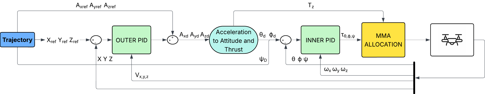
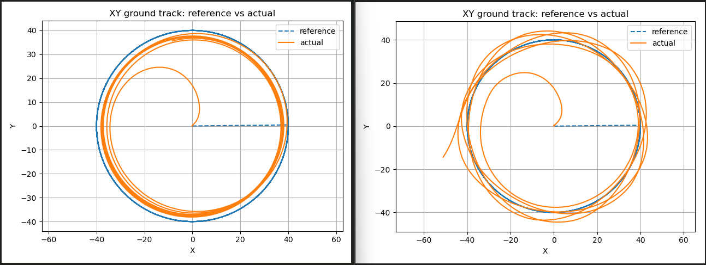

# Dual-Layer Cascaded PID & QP Allocation for UAV Offboard Control

**Author:** Jacopo Dallafior  
**Institution:** University of Trento  
**Stack:** ROS 2, PX4 Autopilot, Eigen, OSQP


---

## 📖 Overview

This repository contains a fully external **Offboard Control Architecture** for quadrotors using **ROS 2** and **PX4**. Unlike standard internal PX4 controllers, this project implements the full control cascade (Position $\to$ Velocity $\to$ Attitude $\to$ Rate $\to$ Torque) offboard.

The core innovation is a **Geometry-Aware Multi-Mixing Allocator (MMA)** based on a **Constrained Quadratic Program (QP)**. This allocator solves the issue of actuator saturation during aggressive maneuvers by strictly preserving the **roll-pitch torque direction** (ensuring stability) while relaxing yaw and thrust priorities when necessary.

### Key Features
* **Full Offboard Cascade:** Replaces PX4 internal loops; computes acceleration, attitude, and normalized motor commands externally.
* **Dual-Layer PID:** * **Outer Loop (50 Hz):** Position/Velocity regulation in Inertial Frame.
    * **Inner Loop (250+ Hz):** Attitude/Rate regulation in Body Frame.
* **Smart Allocation (QP):** Uses the OSQP solver to handle motor limits and slew rates.
* **Direction Preservation:** Maintains control authority over the tilt axis during saturation to prevent trajectory departure.

---

## 🏗️ System Architecture

The controller communicates with PX4 via the microRTPS/uXRCE-DDS bridge, publishing directly to `/fmu/in/actuator_motors`.


*Figure: Overview of the cascaded control structure and allocation logic.*

### 1. Outer Loop (Translational)
The outer loop computes the desired acceleration vector in the NED frame. [cite_start]It uses conditional integration for anti-windup[cite: 50, 51].
$$\mathbf{a}_r = \mathbf{a}_d + K_p(\mathbf{p}_d - \mathbf{p}) + K_d(\mathbf{v}_d - \mathbf{v}) + K_i \mathbf{I}_p$$

### 2. Inner Loop (Rotational)
The desired acceleration is mapped to a specific force and target attitude (Tilt & Yaw). [cite_start]The inner loop tracks this attitude using a PID on Euler errors augmented with body-rate damping[cite: 74, 75].
$$\boldsymbol{\tau} = K_\eta^p \mathbf{e}_\eta + K_\eta^i \mathbf{I}_\eta - K_\omega^d \boldsymbol{\omega}_{lpf}$$

---

## 🧠 The QP Allocator

Standard mixers (Closed-Form Inversion) fail when motors saturate, often clipping commands arbitrarily which leads to trajectory drift. This project uses a **Quadratic Program** to optimize the motor commands $\bm u$.

We solve the following minimization problem at every control cycle:

$$
\min_{\mathbf{u}} \quad \frac{1}{2} \| C(B\mathbf{u} - \mathbf{w}_{des}) \|^2 + \frac{\lambda_{dir}}{2} \| P_{\perp} B_{rp}\mathbf{u} \|^2 + \frac{\rho_v}{2} \| \mathbf{u} - \mathbf{u}_{prev} \|^2
$$

**Subject to:**
* $0 \le \bm u \le 1$ (Motor physical limits)
* $-\Delta \le \bm u - \bm u_{prev} \le \Delta$ (Slew rate limits)

**Why this matters:**
The term $|| P_{\perp} B_{rp}\bm u ||^2$ penalizes deviations from the *direction* of the desired roll-pitch torque. If the drone cannot produce the full required torque, it scales the magnitude down but **keeps the angle correct**, ensuring the drone doesn't tumble or drift sideways.

---

## 📊 Results & Performance

The controller was stress-tested against a standard Least-Squares (CFI) mixer using two trajectories: a **Nominal Figure-8** and an **Aggressive High-Speed Circle** (designed to force saturation).

### Aggressive Circle Comparison
Under sustained saturation (~80% of the flight), the QP allocator maintains trajectory coherence, while the standard mixer drifts significantly.


*Figure: Comparison of aggressive circular trajectories. (a) QP Allocator maintains the radius. (b) Standard Mixer deforms and drifts.*

| Scenario | RMS XY Error [m] | RMS Roll Error [deg] | RMS Pitch Error [deg] | Directional Alignment ($c \ge 0.99$) | 
| :--- | :---: | :---: | :---: | :---: |
| **QP Allocator** | **12.84** | **1.61°** | **1.57°** | **99.4%** |
| Standard Mixer (CFI) | 14.25 | **5.52°** | **5.68°** | 51.4% |

**Key Finding:** The QP allocator reduces attitude error significantly and maintains directional alignment almost 100% of the time, even when motors are maxed out.

---

## 🛠️ Installation & Usage

### Dependencies
* **ROS 2** (Humble recommended)
* **PX4 Autopilot** (v1.13 or v1.14)
* **OSQP** (Operator Splitting Quadratic Program solver)
* **Eigen3**

### Build
```bash
# Clone the repository
mkdir -p uav_control_ws/src
cd uav_control_ws/src
git clone [https://github.com/YOUR_USERNAME/YOUR_REPO_NAME.git](https://github.com/YOUR_USERNAME/YOUR_REPO_NAME.git)

# Install OSQP (if not strictly linked in CMake)
# Ensure Eigen is available

# Build
cd ..
colcon build --symlink-install
source install/setup.bash
